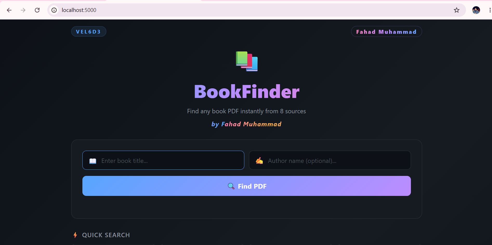
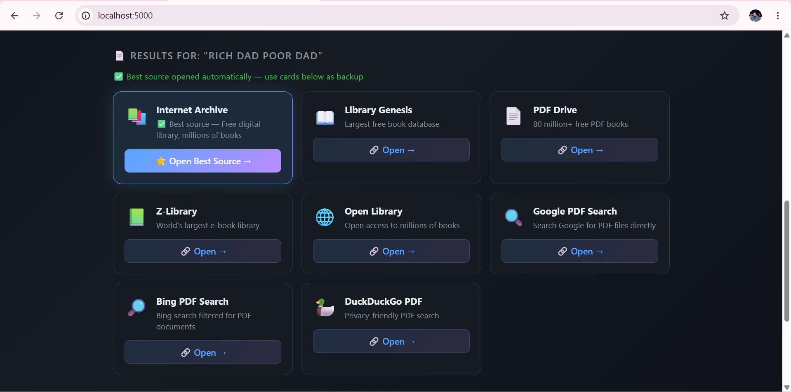
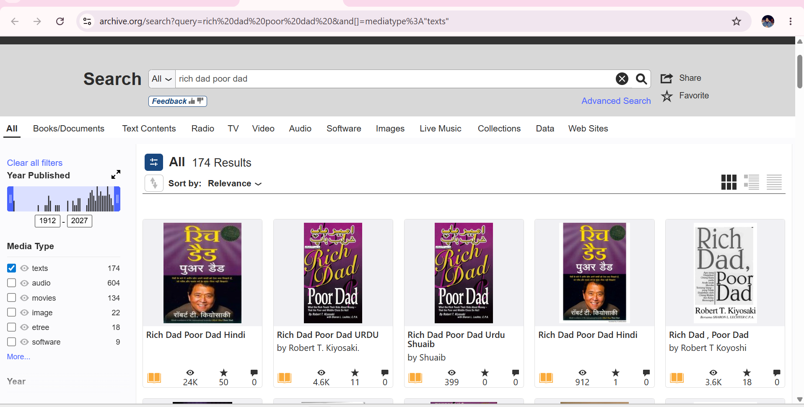
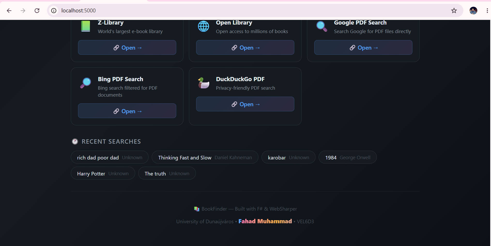

# 📚 BookFinder
> **Find any book PDF instantly from 8 sources.**
> Built with F# and WebSharper — Project Omega

---

## 🌐 Try It Live

### [Click here to open the app](https://khwaja-fahad.github.io/fsharp-functional-programming/WebSharper/BookFinder/)

---

## 📸 Screenshots

### 🏠 Home Page


---

### 🔍 Search Results



---

### ⚡ Quick Search & Recent History


---

## 💡 Problem It Solves

Every student and researcher needs PDF versions of books. The usual process is:
- Open Google → search → wrong results
- Try Archive.org → search again
- Try LibGen → search again
- Repeat across 5+ sites manually

**BookFinder solves ALL of this in one place.**

You type a book name once → click **Find PDF** → the best source opens automatically → 8 backup links appear instantly. One search, eight sources, zero wasted time.

---

## ✨ Features

### 🔍 Smart PDF Search
- Type any book title and optional author name
- Generates optimized search URLs using the `filetype:pdf` operator
- Works across 8 different sources simultaneously
- Encoded URLs handle spaces and special characters correctly

### ⭐ Auto-Open Best Source
- After clicking **Find PDF**, Internet Archive opens automatically in a new tab
- Internet Archive is chosen as best — it has millions of free, legal books
- No extra clicks needed — the best result comes to you

### 🌀 Loading Animation
- A spinner appears with status messages while sources are prepared
- "Searching across all sources..." and "Opening best result automatically..."
- 1.8 second delay gives a realistic search feel

### 📚 8 Search Sources
| Source | Description |
|---|---|
| 📚 Internet Archive | Free digital library — best source, opens automatically |
| 📖 Library Genesis | Largest free book database |
| 📄 PDF Drive | 80 million+ free PDF books |
| 📗 Z-Library | World's largest e-book library |
| 🌐 Open Library | Open access to millions of books |
| 🔍 Google PDF Search | filetype:pdf operator on Google |
| 🔎 Bing PDF Search | filetype:pdf operator on Bing |
| 🦆 DuckDuckGo PDF | Privacy-friendly PDF search |

### ⚡ Quick Search
- 8 popular books pre-loaded as one-click buttons
- Includes: Clean Code, 1984, Atomic Habits, Harry Potter and more
- Click any button → instantly searches that book across all 8 sources

### 🕐 Search History
- Last 8 searches automatically saved
- Click any history item to re-search instantly
- Duplicates removed automatically — clean history always

### 🎨 Beautiful Dark UI
- GitHub-inspired dark theme
- Animated rainbow gradient for author name
- Best source card highlighted with blue glow
- Hover animations on all cards
- Fully responsive — works on mobile and desktop

---

## 🧠 F# Concepts Used

- **Record types** — `SearchSource` and `SearchResult` as immutable data structures
- **Discriminated unions** — `IsBest: bool` field to distinguish best source
- **Higher order functions** — `List.map`, `List.filter`, `List.tryFind`, `List.distinctBy`, `List.truncate`
- **Pattern matching** — `match best with | Some s -> ... | None -> ()`
- **Reactive variables** — `Var.Create` for `titleVar`, `authorVar`, `resultsVar`, `historyVar`, `loadingVar`, `searchedVar`, `msgVar`
- **Views and Doc.BindView** — all UI updates reactively from state, no manual DOM manipulation
- **Immutable list updates** — history built with `::` prepend and `List.truncate`
- **JS interop** — `JS.EncodeURIComponent`, `JS.SetTimeout`, `JS.Window.Open`
- **Function composition** — `buildSources` produces full URL list from title + author inputs
- **Pipeline operator** — `|>` used throughout for clean functional style

---

## 🔎 How the Search Technique Works

BookFinder uses the **Google Operator filetype trick**:

```
filetype:pdf "Book Title" "Author Name"
```

This forces search engines to return **only PDF documents** — not web pages, not HTML, not anything else. Just PDFs.

BookFinder generates this optimized URL for every source:

```fsharp
let buildSources (title: string) (author: string) =
    let enc (s: string) = JS.EncodeURIComponent(s)
    let q  = enc (title + " " + author)
    let qt = enc title
    let qa = enc author
    [
        { Name = "Google PDF Search"
          Url  = "https://www.google.com/search?q=filetype%3Apdf+" + qt + "+" + qa
          IsBest = false }
        // ... 7 more sources
    ]
```

The `%3A` is the encoded `:` character — required so the browser does not break the URL. `JS.EncodeURIComponent` handles spaces and special characters so any book title works correctly.

---

## 🛠️ Technologies

| Technology | Purpose |
|---|---|
| **F#** | Main programming language |
| **WebSharper SPA** | Compiles F# to JavaScript |
| **.NET 10** | Runtime |
| **WebSharper.UI** | Reactive UI — Var, View, Doc.BindView |
| **HTML + CSS** | Page structure and dark theme styling |
| **Vite** | Frontend bundler |
| **JS Interop** | EncodeURIComponent, SetTimeout, Window.Open |

---

## 📁 Project Structure

```
BookFinder/
├── Client.fs                  ← All F# logic — search, state, reactive UI
├── BookFinder.fsproj          ← Project file and dependencies
├── wwwroot/
│   └── index.html             ← HTML shell + complete CSS styles
├── screenshots/               ← Project screenshots for README
│   ├── screenshot-home.png
│   ├── screenshot-results.png
│   └── screenshot-history.png
└── README.md                  ← This file
```

---

## 👨‍💻 Author

**Fahad Muhammad**
University of Dunaújváros, Hungary
Course: Introduction to Functional Programming in F#
Student ID: VEL6D3
GitHub: [Khwaja-Fahad](https://github.com/Khwaja-Fahad)