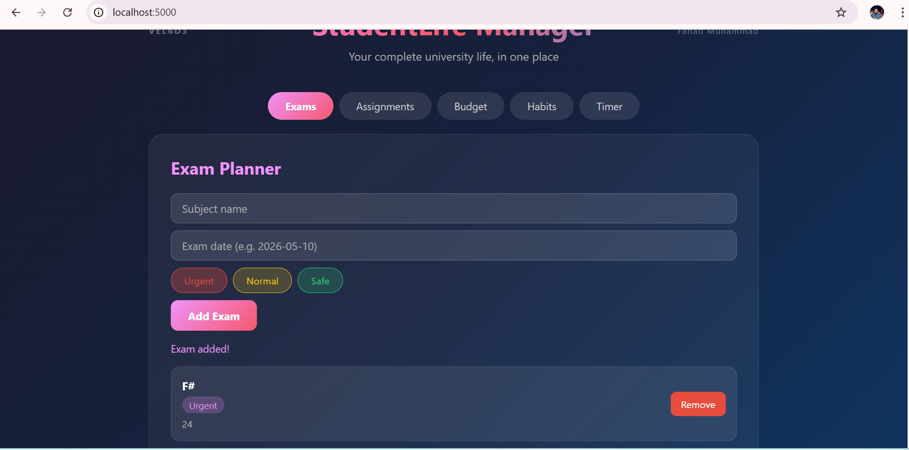

# StudentLife Manager

> **Your complete university life, in one place.**  
> Built with F# and WebSharper — Project Alpha

---

## Try It Live
### [Click here to open the app](https://khwaja-fahad.github.io/fsharp-functional-programming/StudentLife/)

---

## Screenshot


---

## Problem It Solves
Every university student struggles with:
- Forgetting exam dates and priorities
- Missing assignment deadlines
- Running out of money mid-month
- Breaking good study habits
- Studying without focus or tracking

**StudentLife Manager solves ALL of these in one beautiful web app.**

---

## Features

### Exam Planner
- Add exams with subject, date and priority level
- Priority system: Urgent / Normal / Safe
- Remove exams when completed

### Assignment Tracker
- Add assignments with title, subject and deadline
- Mark assignments as done with one click
- Visual strikethrough for completed items
- Remove assignments when done

### Budget Tracker
- Add income and expenses with categories
- Categories: Food, Transport, Books, Fun, Other
- Live balance calculation (green = positive, red = negative)
- Full transaction history with remove option

### Habit Tracker
- Add daily habits to track
- Mark habits as complete each day
- Automatic streak counter per habit
- Undo option if marked by mistake

### Study Timer (Pomodoro)
- 25 minute focused study sessions
- Enter what subject you are studying
- Pause and reset controls
- Automatic study log saved after each session

---

## F# Concepts Used
- Discriminated unions (`Priority`, `TransactionType`)
- Record types (`Exam`, `Assignment`, `Transaction`, `Habit`)
- Pattern matching on types and values
- Higher order functions (`List.map`, `List.filter`, `List.fold`, `List.sumBy`)
- Immutable data with functional updates
- Reactive variables (`Var.Create`)
- Views and `Doc.BindView` for live UI updates
- Mutable state for ID generation and timer
- `JS.SetTimeout` for async timer

---

## Technologies
- **F#** — Functional programming language
- **WebSharper SPA** — F# to JavaScript compiler
- **.NET SDK 10** — Runtime
- **Reactive UI** — Var, View, Doc.BindView

---

## How To Run Locally

```bash
cd WebSharper/StudentLife
dotnet build
dotnet run
```

Then open: `http://localhost:5000`

---

## Author
**Fahad Muhammad**  
University of Dunaújváros, Hungary  
Course: Introduction to Functional Programming in F#  
Student ID: VEL6D3